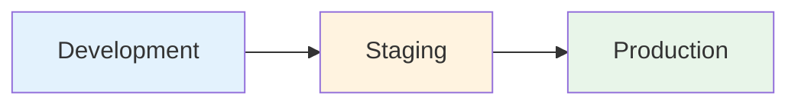

# Architecture Documentation - Service Mesh Observability

## System Overview

Service mesh observability with Istio telemetry, distributed tracing, and metrics collection

## Component Details

### Infrastructure Layer
- High availability across multiple AZs
- Auto-scaling capabilities
- Load balancing

### Security Layer
- Encryption at rest (KMS)
- Encryption in transit (TLS 1.3)
- Network isolation
- IAM policies

### Data Layer
- Primary data store
- Caching layer
- Backup and recovery

### Monitoring Layer
- Metrics collection
- Log aggregation
- Alerting system

## Deployment Architecture

## Network Topology

- VPC: 10.0.0.0/16
- Public Subnets: 10.0.1.0/24, 10.0.2.0/24
- Private Subnets: 10.0.11.0/24, 10.0.12.0/24

## Scalability

- Horizontal scaling with auto-scaling groups
- Vertical scaling for database tier
- Multi-region capability

## Disaster Recovery

- **RTO**: 15 minutes
- **RPO**: 5 minutes
- Automated backups
- Cross-region replication

## Cost Optimization

- Spot instances for non-critical workloads
- Reserved instances for steady-state
- Auto-scaling to match demand
- Lifecycle policies for storage

---

**Last Updated**: 2025-11-06
