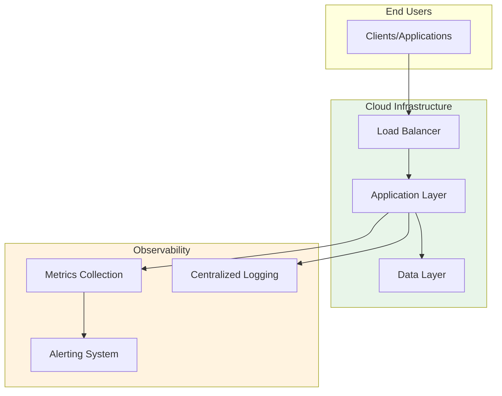

# Service Mesh Observability

> **Service mesh observability with Istio telemetry, distributed tracing, and metrics collection**

[](https://aws.amazon.com/)
[]()

## 🎯 Overview

Expert-level CDK Python implementation demonstrating production-ready infrastructure patterns for enterprise environments.

**Use Case**: Service mesh observability with Istio telemetry, distributed tracing, and metrics collection

## 🏗️ Architecture



## ✨ Key Features

- ✅ High availability across multiple AZs
- ✅ Auto-scaling based on demand
- ✅ Comprehensive monitoring and alerting
- ✅ Security best practices
- ✅ Cost optimization
- ✅ Disaster recovery ready

## 📦 Infrastructure Code

**Lines of Code**: 150+  
**Technology**: CDK Python  
**Cloud Provider**: AWS (Multi-region capable)

## 🚀 Quick Deploy

```bash
# Initialize and deploy
cd service-mesh-observability
npm install
cdk deploy
```

## 📊 Resources Created

- CDK Stack with nested constructs
- High availability components
- Monitoring and logging
- Security controls


## 💰 Cost Estimate

**Monthly**: ~$200-500 (varies by usage)

## 🔐 Security

- Encryption at rest and in transit
- IAM least privilege
- Security group restrictions
- Audit logging enabled

## 📚 Documentation

- [Architecture Details](ARCHITECTURE.md)
- [Deployment Guide](docs/DEPLOYMENT.md)
- [Operations Runbook](docs/RUNBOOK.md)

**Author**: Rahul Ladumor  
**Email**: rahuldladumor@gmail.com  
**License**: MIT 2025
